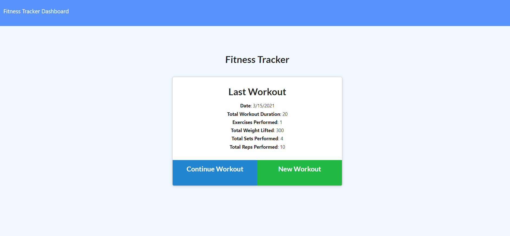
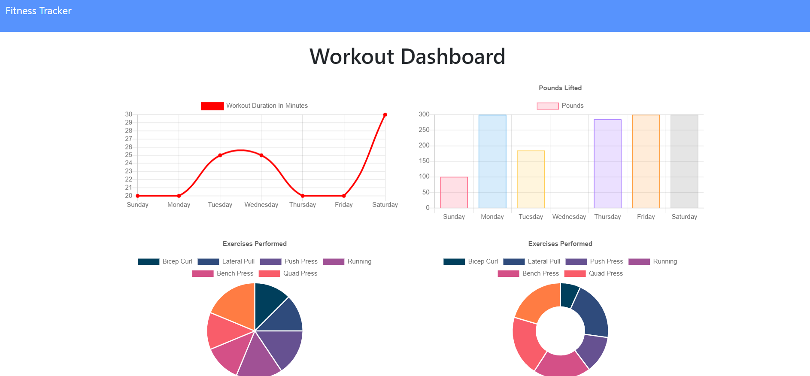

# Workout Tracker <p style="float: right;"><a href="https://opensource.org/licenses/MIT"></a></p>
An application that tracks daily workouts
## Description
Track your workouts using this application! This applcation tracks your workouts and displays a weekly summary of the workouts you have done.
This repository contains the _**Workout Tracker**_ application, which was created using [Node](https://nodejs.org/en/), [Express](https://expressjs.com/), [Mongo_DB](https://www.mongodb.com/), the npm packages [Mongoose](https://www.npmjs.com/package/mongoose) and [Morgan](https://www.npmjs.com/package/morgan), and hosted on [Heroku](https://www.heroku.com). 

#### Functionality
1. The program allows a user the ability to choose or create a workout. 
2. When a choice is made, the user is shown multiple boxes that can be filled in to flesh out the workout.  
3. When submitted, the workout is stored in **mongoDB**.
4. The **dashboard** will allow a user to see a weekly summary of their progress.

#### Try It Out
Feel free to visit the app: [Fitness Workout Tracker](https://afternoon-sea-91159.herokuapp.com/)



## Table of Contents
* [Installation](#installation)
* [Usage](#usage)
* [Contributions](#contributions)
* [Test Instructions](#test-instructions)
* [License](#license)
* [Questions](#questions)

### Installation 
To install this program, it's as simple as cloning the files to your local machine.  Once in the directory, run:
```
npm i
```
This will install the modules/dependencies needed to run the program.
### Usage
To run this program, open the integrated terminal where this program is cloned to.  Run:
```
npm run seed
```
to seed the database.  After this, run:
```
node server
```
or
```
npm run start
```
This will start the program and log to the console the localhost address to visit.
### Contributions
The main purpose of this repository is to utilize the power of [Mongo_DB](https://www.mongodb.com/) and [Mongoose](https://www.npmjs.com/package/mongoose) package. If anyone is willing to contribute to the program, feel free to download it and create a separate branch and improve on it.  Also, feel free to get in touch with me through my email as well.

### Test Instructions
As for this repository, all the testing was done through localhost as well as utilizing [Robo 3t](https://robomongo.org/).

### License
This project falls under the license: 
[](https://opensource.org/licenses/MIT)
    
### Questions
If you haven't already, and would like to visit my github profile, you can reach me at: https://github.com/DavidESotomayor

Please feel free to reach out to me for any questions, comments, or concerns at : david.elijah.sotomayor@gmail.com

Copyright &copy; David Sotomayor

### Sources
* [Express.js](https://expressjs.com/)
* [Heroku](https://www.heroku.com)
* [Mongo_DB](https://www.mongodb.com/)
* [Node.js](https://nodejs.org/en/)
* [npm / npm dependencies](https://www.npmjs.com/)
  * [Express](https://www.npmjs.com/package/express)
  * [Mongoose](https://www.npmjs.com/package/mongoose)
  * [Morgan](https://www.npmjs.com/package/morgan)

